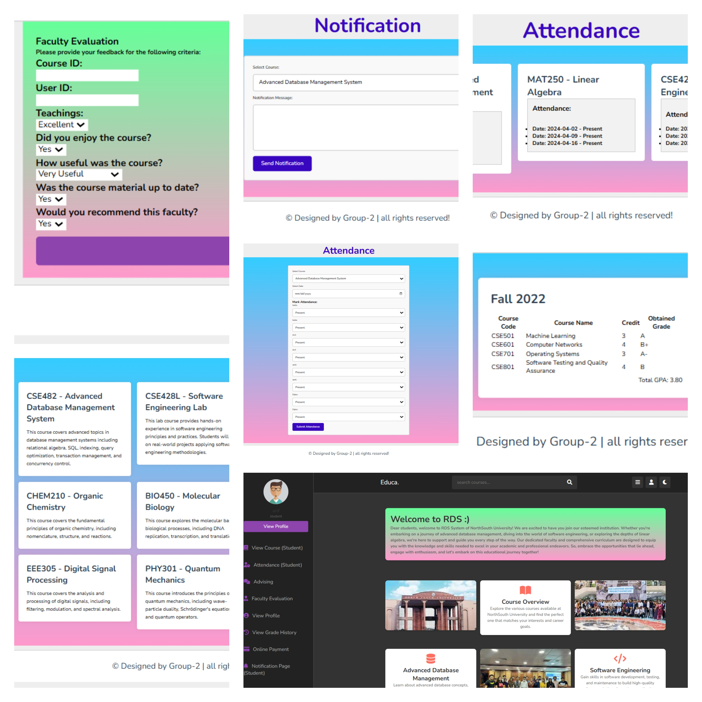

# PHP Web Development Project



---

## 📖 Overview
This project is a fully functional **web application built without any frameworks**, meaning everything was hard-coded from scratch. 💻🔧  

The main challenge — and learning opportunity — was implementing robust features manually, which deepened my understanding of **PHP, MySQL, and full-stack development**.  

---

## 🚀 Tech Stack
- **Front-end:** HTML, CSS  
- **Back-end:** PHP  
- **Database:** MySQL  
- **Deployment:** Free hosting site  

---

## ✨ Key Features
- 🔸 Session handling  
- 🔸 Responsiveness across all pages  
- 🔸 Lazy loading  
- 🔸 AJAX live search  
- 🔸 Cookies and cache management  
- 🔸 Service worker  
- 🔸 API integration  
- 🔸 Performance optimization of web  
- 🔸 Network security  

---

## 🎥 Demo & Screenshots
🔗 **Live Demo:** [Add your hosted link here]  

📸 **Screenshots:**  
(Add screenshots or GIFs here showing key pages and features)  

---

## 🛠️ How to Run Locally

1. **Clone the repository**
   ```bash
   git clone https://github.com/your-username/your-repo.git
   cd your-repo
2. **Start a PHP server (Method 1: Built-in PHP server)**

  php -S localhost:8000
  Then visit 👉 http://localhost:8000

OR

Method 2: XAMPP/WAMP

Copy this project folder into htdocs (XAMPP) or www (WAMP).

Start Apache and MySQL from the control panel.

Import the provided .sql file into your MySQL database.

Visit 👉 http://localhost/your_project_folder

3. **Configure Database**

Update your config.php (or equivalent) file with your database username, password, and DB name.


Update your config.php (or equivalent) file with your database username, password, and DB name.
